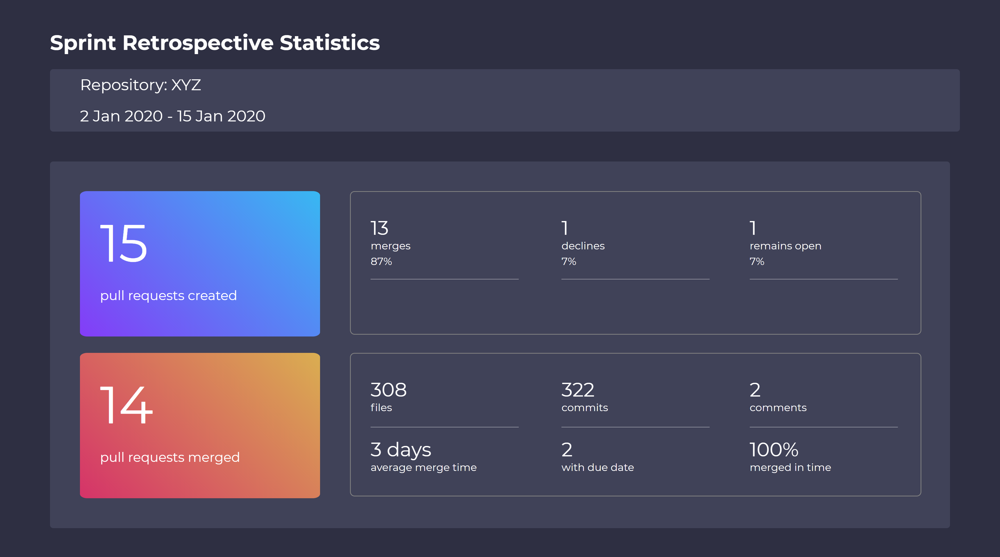

To install the dependencies for this project in both frontend and backend folders, use

```bash
npm install
```

To start the backend server in folder "frontend-exercise", use

```bash
npm run dev
```
and you should be able to call the REST endpoint at [http://localhost:8082/statistics](http://localhost:8082/statistics). 

To start the frontend server in folder "react-stats", use

```bash
npm start
```
and you should be able to see this .