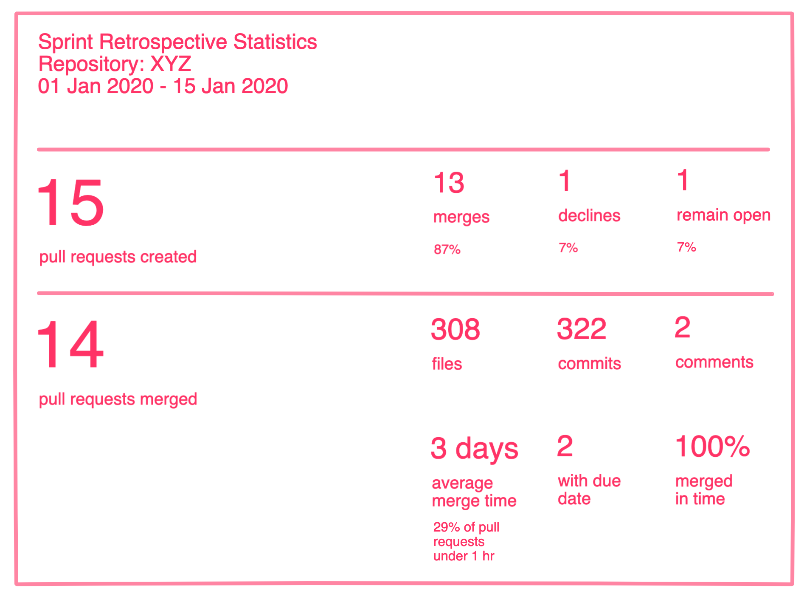

# Frontend Exercise

Call the REST endpoint `/statistics` and visualize the data according to the following UI mockup in the file `index.html`:



If you see some better way to communicate the data to the user, this is of course appreciated.

You can use any libraries of your choice to implement this.

To install the dependencies for this project, use

```bash
npm install
```

To start the server, use

```bash
npm run dev
```

and you should be able to call the REST endpoint at [http://localhost:8082/statistics](http://localhost:8082/statistics). 